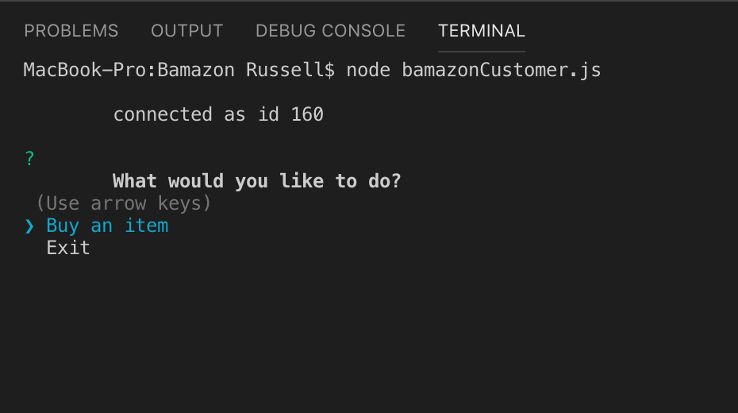
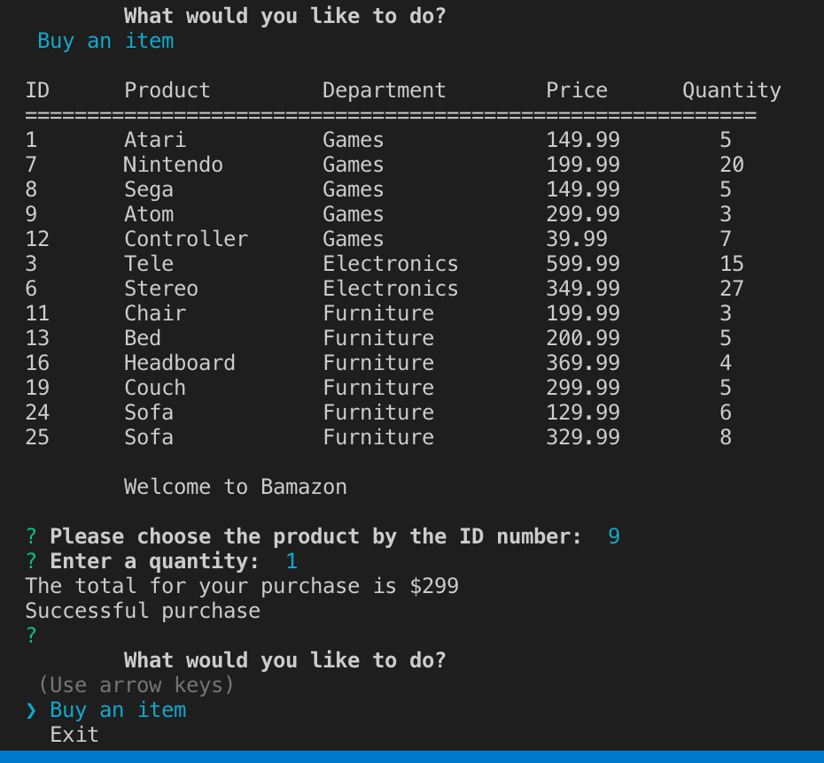
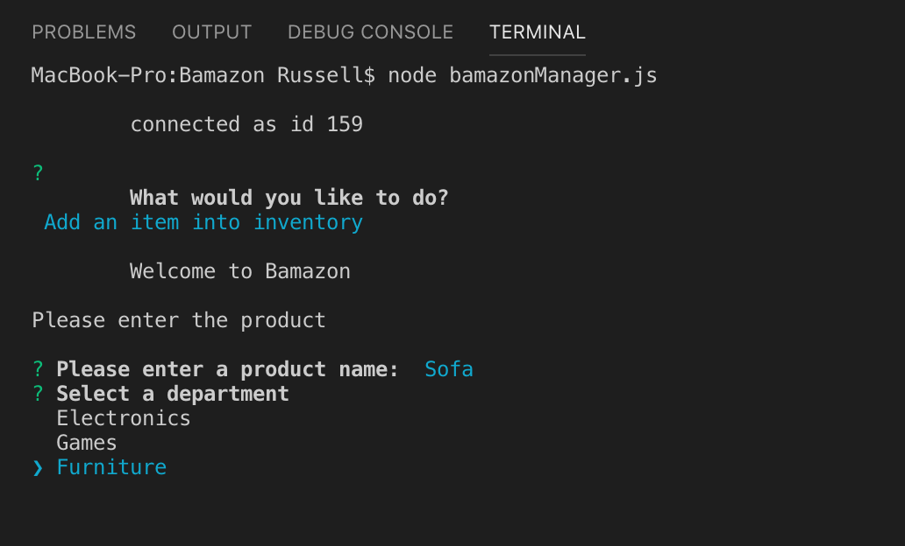
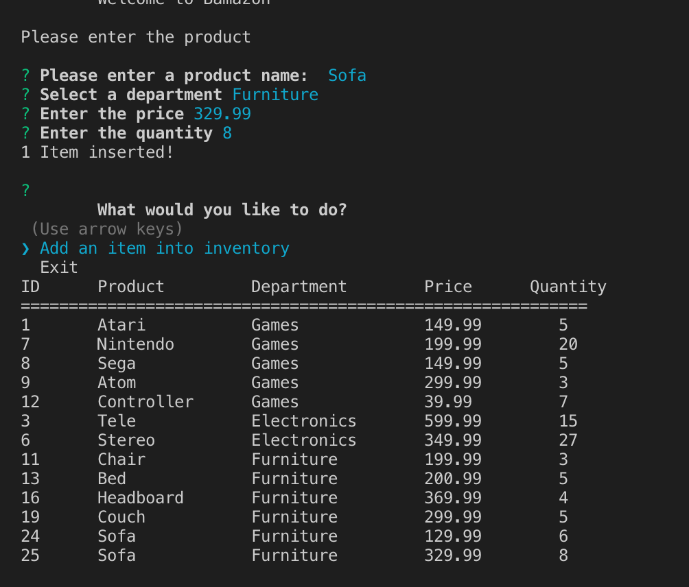
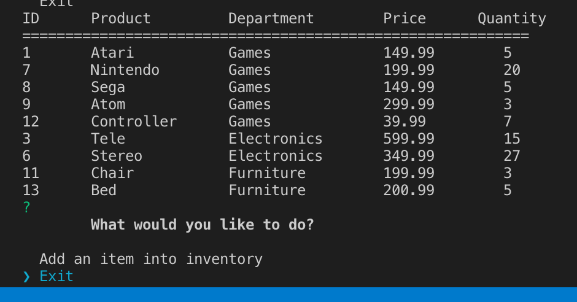

# Bamazon
#### Storefront interface using Nodejs and Mysql

#### Also added manager interface to add products to the database

#### In the storefront, a customer selects an item using the item number

### Node Interface

### The program reduces the quantity and computes the total cost

### In the manager version, a manager can enter products directly into inventory

### Node Interface

:earth_americas: